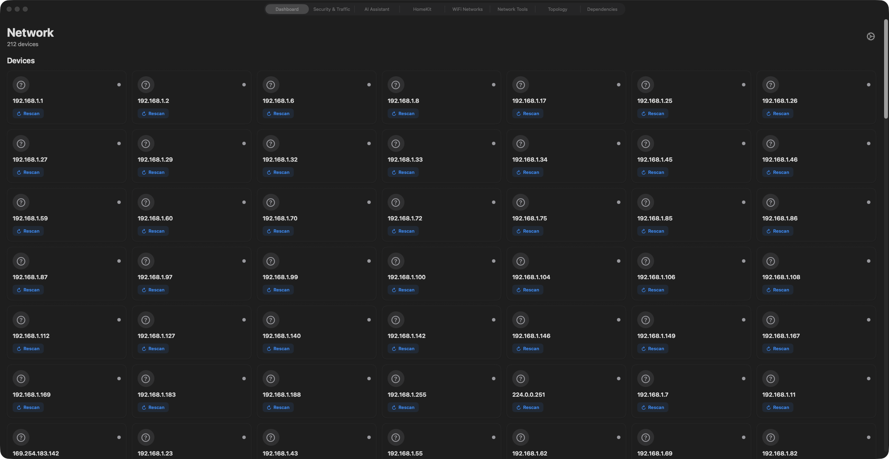

# NMAPScanner


A native macOS network security scanner that wraps nmap in a modern SwiftUI interface, adding AI-powered threat detection, device management, UniFi controller integration, compliance reporting, and a local REST API for automation. All AI inference runs on-device using Apple Silicon -- no data leaves your machine.



---

## Table of Contents

- [Architecture](#architecture)
- [Features](#features)
- [Nova API Server](#nova-api-server)
- [Screenshots](#screenshots)
- [Requirements](#requirements)
- [Installation](#installation)
- [Build from Source](#build-from-source)
- [Usage](#usage)
- [Security](#security)
- [Version History](#version-history)
- [License](#license)
- [More Apps](#more-apps-by-jordan-koch)

---

## Architecture

```
+====================================================================+
|                     NMAPScanner  (macOS App)                       |
|                         SwiftUI + AppKit                           |
+====================================================================+
|                                                                    |
|  +--------------------+   +---------------------+   +------------+ |
|  |   ContentView      |   |   MenuBarAgent      |   |  Widgets   | |
|  |   (MainTabView)    |   |   (NSStatusItem)    |   | (WidgetKit)| |
|  +--------+-----------+   +----------+----------+   +------+-----+ |
|           |                          |                     |       |
|  +--------v---------------------------------------------------+    |
|  |                    8-Tab Navigation                         |    |
|  |                                                             |    |
|  | +------------+ +----------------+ +-----------+ +--------+  |   |
|  | | Dashboard  | | Security &     | |    AI     | |HomeKit |  |   |
|  | |   (V3)     | | Traffic        | | Assistant | |  Tab   |  |   |
|  | +------------+ +----------------+ +-----------+ +--------+  |   |
|  | +------------+ +----------------+ +-----------+ +--------+  |   |
|  | |   WiFi     | | Network Tools  | | Topology  | | Deps   |  |   |
|  | | Networks   | | (Ping/Trace/   | |   Graph   | | Graph  |  |   |
|  | |            | |  DNS/ARP)      | |           | |        |  |   |
|  | +------------+ +----------------+ +-----------+ +--------+  |   |
|  +-------------------------------------------------------------+   |
|                                                                    |
+--------------------------------------------------------------------+
|                         Core Engine Layer                           |
+--------------------------------------------------------------------+
|                                                                    |
|  +-----------------------+     +-----------------------------+     |
|  |  Scanning Subsystem   |     |    AI / ML Subsystem        |     |
|  |-----------------------|     |-----------------------------|     |
|  | IntegratedScannerV3   |     | MLXInferenceEngine          |     |
|  | AdvancedPortScanner   |     | AIBackendManager            |     |
|  |   - Quick Scan        |     |   (Ollama / MLX / TinyLLM)  |     |
|  |   - Standard Scan     |     | AISecurityAnalyzer          |     |
|  |   - Comprehensive     |     | MLXThreatAnalyzer           |     |
|  |   - Aggressive        |     | MLXDeviceClassifier         |     |
|  |   - Stealth           |     | MLXAnomalyDetector          |     |
|  | PingScanner (115      |     | ShadowAIDetector            |     |
|  |   ports parallel)     |     | LLMSecurityReportGenerator  |     |
|  | BonjourScanner        |     | EthicalAIGuardian           |     |
|  | ARPScanner            |     +-----------------------------+     |
|  | WiFiNetworkScanner    |                                         |
|  | ServiceVersionScanner |     +-----------------------------+     |
|  | BannerGrabber         |     |    Security Subsystem        |     |
|  +-----------------------+     |-----------------------------|     |
|                                | VulnerabilityScanner         |     |
|  +-----------------------+     | SSLCertificateAnalyzer       |     |
|  |  Network Subsystem    |     | DNSSecurityAnalyzer          |     |
|  |-----------------------|     | InsecurePortDetector         |     |
|  | NetworkTrafficAnalyzer|     | ProtocolVulnerabilityScanner |     |
|  | PacketCaptureManager  |     | AuthenticationAuditor        |     |
|  | RealtimeTrafficManager|     | MalwarePatternDetector       |     |
|  | LocalNetworkMonitor   |     | RogueDeviceDetector          |     |
|  | DNSResolver           |     | IoTSecurityScorer            |     |
|  | NetworkSegmentation-  |     | ComplianceFramework          |     |
|  |   Analyzer            |     |   (NIST/CIS/PCI/HIPAA/SOC2) |     |
|  +-----------------------+     | SecurityAuditManager         |     |
|                                +-----------------------------+     |
+--------------------------------------------------------------------+
|                       Integration Layer                            |
+--------------------------------------------------------------------+
|                                                                    |
|  +---------------------+  +------------------+  +---------------+  |
|  |  UniFi Controller   |  |  HomeKit         |  | Nova API      |  |
|  |---------------------|  |  Discovery       |  | Server        |  |
|  | UniFiController     |  |------------------|  |  (port 37423) |  |
|  | SecureUniFiDelegate |  | HomeKitDiscovery |  |---------------|  |
|  | UniFiDeviceIdentify |  | HomeKitPort-     |  | /api/status   |  |
|  | UniFiDiscovery-     |  |   Definitions    |  | /api/scan/*   |  |
|  |   Scanner           |  | BonjourScanner   |  | /api/security |  |
|  | WiFiSecurityAnalyzer|  +------------------+  | /api/wifi     |  |
|  +---------------------+                        | /api/unifi    |  |
|                                                  | /api/threats  |  |
|  +---------------------+  +------------------+  |   (STIX 2.1)  |  |
|  |  Export / Reporting  |  | Device Mgmt      |  +---------------+  |
|  |---------------------|  |------------------|                     |
|  | ExportManager       |  | DevicePersistence|  +---------------+  |
|  |  (PDF/CSV/JSON/HTML)|  | DeviceGrouping-  |  | Scheduled     |  |
|  | MarkdownExporter    |  |   Manager        |  | Scans         |  |
|  | DeviceExportManager |  | DeviceReputation |  |---------------|  |
|  | ComplianceChecker   |  |   Scorer         |  | ScheduledScan |  |
|  +---------------------+  | DeviceUptime-    |  |   Manager     |  |
|                            |   Tracker        |  | ScanScheduler |  |
|                            | DeviceWhitelist  |  | ScanWatchdog  |  |
|                            +------------------+  +---------------+  |
|                                                                    |
+--------------------------------------------------------------------+
|                       System Layer                                 |
+--------------------------------------------------------------------+
|                                                                    |
|  /usr/local/bin/nmap          macOS Keychain (UniFi credentials)   |
|  Network.framework (NWListener, NWConnection)                      |
|  UserNotifications.framework  WidgetKit.framework                  |
|  Security.framework           HomeKit entitlement                  |
|  Swift Structured Concurrency (async/await, TaskGroup, actors)     |
|                                                                    |
+--------------------------------------------------------------------+
```

---

## Features

### Scanning Engine

| Capability | Details |
|---|---|
| Network Discovery | ARP, ping, Bonjour, and nmap-based host detection |
| Port Scanning | 115 ports scanned in parallel (10 concurrent hosts), 5 scan profiles (Quick/Standard/Comprehensive/Aggressive/Stealth) |
| OS Detection | nmap OS fingerprinting for all discovered devices |
| Service Versions | Banner grabbing and nmap service version probes |
| WiFi Networks | Discover and analyze nearby wireless networks |
| HomeKit Discovery | Correlate HomeKit accessories with network hosts via Bonjour |

### AI / Machine Learning (Apple Silicon)

- **On-device inference** via MLX, Ollama, or TinyLLM backends -- no cloud required
- **Threat analysis** -- AI-powered severity scoring and remediation recommendations
- **Anomaly detection** -- baseline learning with deviation alerts
- **Device classification** -- automatic categorization of discovered hosts
- **Shadow AI detection** -- find unauthorized LLM/AI services running on your network
- **Security report generation** -- LLM-authored narrative security reports
- **Ethical AI guardian** -- enforces responsible scanning policies

### Security Analysis

- Vulnerability scanning with CVE cross-referencing
- SSL/TLS certificate inspection and grading
- DNS security analysis (DNSSEC, zone transfer checks)
- Protocol vulnerability assessment
- Insecure port detection with remediation guidance
- Malware port pattern matching (12 known backdoor ports)
- Authentication auditing
- IoT device security scoring
- Rogue device detection and alerting

### Compliance Reporting

Built-in validation against six industry frameworks:

- **NIST** Cybersecurity Framework
- **CIS** Critical Security Controls
- **PCI-DSS** (Payment Card Industry)
- **HIPAA** Security Rule
- **SOC 2** Type II
- **ISO 27001**

### Device Management

- **Whitelist** -- trust known devices, suppress alerts
- **Block** -- add to blocklist with optional pfctl firewall rules
- **Deep Scan** -- launch aggressive nmap scan (`-A -T4 -p-`) on individual hosts
- **Isolate** -- VLAN isolation via UniFi Controller API
- **Reputation Scoring** -- track device trust over time
- **Uptime Tracking** -- monitor device availability history
- **Grouping** -- organize devices by type, location, or custom tags

### UniFi Integration

- Authenticate to UniFi OS / UDM Pro controllers
- List managed clients and infrastructure devices
- Identify UniFi Protect cameras
- Create firewall rules and VLAN assignments remotely
- Secure certificate handling with user-confirmed trust (SecureUniFiDelegate)
- WiFi network security analysis from controller data

### Reporting and Export

- **PDF** -- professional security audit documents
- **CSV** -- spreadsheet-ready data export
- **JSON** -- structured data for automation pipelines
- **HTML** -- styled reports with XSS-safe output
- **Markdown** -- lightweight export for documentation
- **STIX 2.1** -- machine-readable IoC bundles for SIEM integration

### Threat Intelligence (STIX 2.1)

Export, import, and share threat findings in the industry-standard STIX 2.1 format:

```bash
# Export findings as STIX 2.1 bundle
curl http://127.0.0.1:37423/api/threats/ioc

# Full structured export for SIEM dashboards
curl http://127.0.0.1:37423/api/threats/export

# Import an external threat feed
curl -X POST http://127.0.0.1:37423/api/threats/import \
  -H "Content-Type: application/json" \
  -d @threat_feed.json
```

### macOS Integration

- **Menu bar agent** -- persistent status icon with quick scan, device list, and threat count
- **WidgetKit widgets** -- small, medium, and large widgets showing security score, device counts, threat status, and scan schedule
- **Notification Center** -- alerts for new devices, threats, and scan completions
- **Scheduled scans** -- configurable intervals with scan history and watchdog
- **Runs in background** -- optional "close window, keep scanning" mode

---

## Nova API Server

NMAPScanner includes a built-in REST API on port **37423** (loopback only) for integration with [Nova](https://github.com/kochj23) (OpenClaw AI) and other local automation tools.

**No authentication required** -- the server binds exclusively to `127.0.0.1` and is not reachable from the network.

### Endpoints

| Method | Path | Description |
|--------|------|-------------|
| `GET` | `/api/status` | App status, version, device/warning counts, uptime |
| `GET` | `/api/ping` | Health check |
| `GET` | `/api/scan/results` | Port scan results (IP, hostname, ports, OS, services) |
| `POST` | `/api/scan/start` | Start a scan (`{"ip":"192.168.1.0/24"}`) |
| `GET` | `/api/security/warnings` | AI security warnings with severity, remediation, CVE refs |
| `GET` | `/api/wifi` | Discovered WiFi networks (SSID, BSSID, RSSI, security) |
| `GET` | `/api/unifi/devices` | UniFi managed devices (MAC, IP, name, wired/wireless) |
| `GET` | `/api/threats/ioc` | STIX 2.1 indicator bundle |
| `GET` | `/api/threats/export` | Full structured threat export |
| `POST` | `/api/threats/import` | Import external STIX 2.1 threat feed |

### Example

```bash
# Check status
curl -s http://127.0.0.1:37423/api/status | python3 -m json.tool

# Get all security warnings
curl -s http://127.0.0.1:37423/api/security/warnings | python3 -m json.tool

# Start a targeted scan
curl -X POST http://127.0.0.1:37423/api/scan/start \
  -H "Content-Type: application/json" \
  -d '{"ip":"192.168.1.1"}'
```

The API server starts automatically on launch and stops on app termination.

---

## Screenshots

<!-- Replace with actual screenshots as they become available -->

| View | Description |
|------|-------------|
|  | Main dashboard with device grid, scan controls, and threat summary |

> Additional screenshots for the Security Dashboard, AI Assistant, Topology Graph, and Widget views will be added in a future release.

---

## Requirements

### System

| Requirement | Minimum |
|---|---|
| macOS | 14.0 (Sonoma) or later |
| Architecture | Universal (Apple Silicon recommended for AI features) |
| nmap | Required -- install via Homebrew |

### For AI Features (Optional)

| Requirement | Details |
|---|---|
| Apple Silicon | M1 / M2 / M3 / M4 |
| RAM | 8 GB or more recommended |
| AI Backend | One of: [Ollama](https://ollama.com), MLX via `mlx-lm`, or [TinyLLM](https://github.com/jasonacox/TinyLLM) |

### For UniFi Integration (Optional)

- UniFi OS controller (UDM Pro, UDM SE, Cloud Key Gen2, etc.)
- Controller credentials stored in macOS Keychain

---

## Installation

### 1. Install nmap

```bash
brew install nmap
```

### 2. Install NMAPScanner

Download the latest DMG from [Releases](https://github.com/kochj23/NMAPScanner/releases), open it, and drag **NMAPScanner** to your Applications folder.

> This app is distributed directly via DMG. It is not available on the Mac App Store.

### 3. (Optional) Install an AI Backend

```bash
# Option A: Ollama (recommended)
brew install ollama
ollama pull llama3

# Option B: MLX
pip install mlx-lm

# Option C: TinyLLM by Jason Cox
# See https://github.com/jasonacox/TinyLLM
```

---

## Build from Source

```bash
git clone https://github.com/kochj23/NMAPScanner.git
cd NMAPScanner
open NMAPScanner.xcodeproj
```

Select the **NMAPScanner** scheme, choose your Mac as the run destination, and build with Cmd+B. The project requires Xcode 15+ and the macOS 14 SDK.

---

## Usage

### Quick Start

1. Launch NMAPScanner
2. Enter a network range (e.g., `192.168.1.0/24`) or use the auto-detected subnet
3. Click **Scan Network**
4. Browse discovered devices in the dashboard grid

### Device Actions (Right-Click Menu)

| Action | What It Does |
|--------|-------------|
| **Whitelist** | Add to trusted list, suppress future alerts |
| **Block** | Add to blocklist, optionally create pfctl firewall rule (requires admin) |
| **Deep Scan** | Run aggressive nmap scan with all ports, OS detection, and scripts |
| **Isolate** | Mark for VLAN isolation (requires UniFi controller) |

### Scan Profiles

| Profile | nmap Equivalent | Use Case |
|---------|----------------|----------|
| Quick | `-sS --top-ports 100` | Fast sweep of common ports |
| Standard | `-sT -sV` | Service detection on TCP ports |
| Comprehensive | `-sS -sU -sV -O` | Full TCP + UDP with OS detection |
| Aggressive | `-A -T4 -p-` | Everything: OS, versions, scripts, traceroute |
| Stealth | `-sS -T2 -f` | Low-profile scan to avoid IDS detection |
| Custom | User-defined | Full control over nmap arguments |

### Network Tools Tab

Five built-in diagnostic utilities, no terminal required:

- **Ping** -- test host reachability with quick-access presets
- **Traceroute** -- visualize packet routing paths
- **Network Config** -- display TCP/IP settings (ifconfig)
- **DNS Lookup** -- query DNS servers (nslookup)
- **ARP Table** -- view IP-to-MAC address mappings

---

## Security

### Hardening Measures

- **Command injection prevention** -- all IP addresses and port ranges validated against strict patterns before passing to nmap or pfctl
- **Python code injection prevention** -- AI prompts passed via secure JSON file, never interpolated into source
- **XSS prevention** -- HTML entity escaping applied to all user-supplied data in export reports
- **Race condition prevention** -- NSLock synchronization in async DNS resolution
- **Safe type casting** -- conditional casts throughout; no force unwraps on external data
- **Secure UniFi TLS** -- certificate validation with user-confirmed trust, not blanket acceptance
- **Input sanitization** -- all network-sourced data sanitized before shell command use

### Privacy

- All scanning happens locally on your network
- Scan results never leave your Mac
- AI inference runs on-device (no cloud calls)
- UniFi credentials stored in macOS Keychain
- No telemetry, no analytics, no phone-home

### Ethical Use

This tool is for **defensive security only**. Scan only networks you own or have written authorization to test. Follow all applicable computer security laws in your jurisdiction.

---

## Version History

| Version | Date | Highlights |
|---------|------|------------|
| **8.9.0** | April 2026 | STIX 2.1 threat intelligence (export/import/IoC), ~40 compiler warnings resolved |
| **8.8.0** | March 2026 | macOS WidgetKit support (small/medium/large security widgets) |
| **8.7.0** | February 2026 | Security hardening audit -- 25 findings resolved (1 Critical, 7 High, 7 Medium, 6 Low, 2 Info) |
| **8.6.0** | January 2026 | Device actions (whitelist/block/deep scan/isolate), MLX backend integration |
| **8.5.0** | December 2025 | 115-port comprehensive scanning, expanded device coverage |
| **8.4.0** | December 2025 | 65-80% scan speed improvement, parallel port scanning, smart Bonjour termination |
| **8.3.0** | December 2025 | Service dependency graph, removed unstable netstat tool |
| **8.2.0** | December 2025 | Network Tools tab (ping, traceroute, DNS, ARP, network config) |
| **8.0.0** | November 2025 | Initial public release -- scanning, AI threat detection, UniFi, reporting |

---

## Project Structure

```
NMAPScanner/
  NMAPScanner/              Main app source (~140 Swift files)
    AICapabilities/         Unified AI capability modules
    Accessibility/          VoiceOver and accessibility helpers
    NMAPApp.swift           App entry point and AppDelegate
    ContentView.swift       Root view (wraps MainTabView)
    MainTabView.swift       8-tab navigation controller
    NovaAPIServer.swift     REST API on port 37423
    UniFiController.swift   UniFi OS API client
    MLXInferenceEngine.swift  AI backend abstraction
    ...
  NMAPScanner Widgets/      WidgetKit extension
  NMAPScanner LiveActivity/ Live Activity support
  NMAPScanner.xcodeproj/    Xcode project
  Screenshots/              App screenshots for README
  .github/                  CI workflows, Dependabot, issue templates
  LICENSE                   MIT License
```

---

## License

MIT License -- Copyright 2025-2026 Jordan Koch

See [LICENSE](LICENSE) for the full text.

---

## More Apps by Jordan Koch

| App | Description |
|-----|-------------|
| [MLXCode](https://github.com/kochj23/MLXCode) | Local AI coding assistant for Apple Silicon |
| [Bastion](https://github.com/kochj23/Bastion) | Authorized security testing and penetration toolkit |
| [RsyncGUI](https://github.com/kochj23/RsyncGUI) | macOS GUI for rsync backup and file synchronization |
| [URL-Analysis](https://github.com/kochj23/URL-Analysis) | Network traffic analysis and URL monitoring |
| [TopGUI](https://github.com/kochj23/TopGUI) | macOS system monitor with real-time metrics |
| [rtsp-rotator](https://github.com/kochj23/rtsp-rotator) | RTSP camera stream rotation and monitoring |

> **[View all projects](https://github.com/kochj23?tab=repositories)**

---

Written by Jordan Koch

> **Disclaimer:** This is a personal project created on my own time. It is not affiliated with, endorsed by, or representative of my employer.
