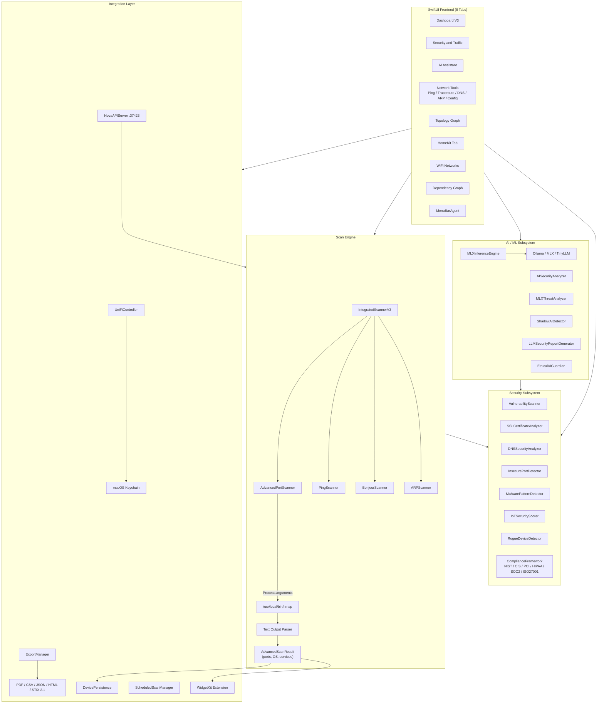

# NMAPScanner

A native macOS network security scanner wrapping nmap in a modern SwiftUI interface with AI-powered threat detection, device management, UniFi controller integration, compliance reporting, and a local REST API.


---

## Features

| Feature | Description |
|---------|-------------|
| Network discovery | ARP, ping, Bonjour, and nmap-based host detection with 115 ports scanned in parallel |
| 6 scan profiles | Quick, Standard, Comprehensive, Aggressive, Stealth, and Custom nmap configurations |
| OS and service detection | nmap OS fingerprinting, service version probes, and banner grabbing |
| AI threat analysis | On-device severity scoring, anomaly detection, device classification, and LLM-generated security reports via Ollama / MLX / TinyLLM |
| Shadow AI detection | Finds unauthorized LLM/AI services running on your network |
| Vulnerability scanning | CVE cross-referencing, SSL/TLS certificate grading, DNS security analysis, insecure port detection, malware port pattern matching |
| Compliance reporting | Validation against NIST, CIS, PCI-DSS, HIPAA, SOC 2, and ISO 27001 frameworks |
| Device management | Whitelist, block (pfctl), deep scan, VLAN isolation (UniFi), reputation scoring, uptime tracking, grouping |
| UniFi integration | Authenticate to UniFi OS controllers, list clients, identify Protect cameras, create firewall rules and VLAN assignments |
| Export formats | PDF, CSV, JSON, HTML, Markdown, and STIX 2.1 threat intelligence bundles |
| 8-tab navigation | Dashboard, Security and Traffic, AI Assistant, Network Tools, Topology Graph, HomeKit, WiFi Networks, Dependency Graph |
| Menu bar agent | Persistent status icon with quick scan, device list, and threat count |
| Desktop widgets | WidgetKit extension (Small / Medium / Large) showing security score, device counts, and scan schedule |
| Scheduled scans | Configurable intervals with scan history and watchdog |
| Nova API server | REST API on port 37423 (loopback only) for automation |

---

## Architecture


```mermaid
graph TD
    subgraph UI["SwiftUI Frontend (8 Tabs)"]
        DASH[Dashboard V3]
        SEC[Security and Traffic]
        AIUI[AI Assistant]
        TOOLS[Network Tools<br/>Ping / Traceroute / DNS / ARP / Config]
        TOPO[Topology Graph]
        HK[HomeKit Tab]
        WIFI[WiFi Networks]
        DEP[Dependency Graph]
        MENU[MenuBarAgent]
    end

    subgraph Engine["Scan Engine"]
        ISV3[IntegratedScannerV3]
        ISV3 --> APS[AdvancedPortScanner]
        ISV3 --> PING[PingScanner]
        ISV3 --> BONJ[BonjourScanner]
        ISV3 --> ARP[ARPScanner]
        APS -->|Process.arguments| NMAP["/usr/local/bin/nmap"]
        NMAP --> PARSER[Text Output Parser]
        PARSER --> RESULT["AdvancedScanResult<br/>(ports, OS, services)"]
    end

    subgraph AI["AI / ML Subsystem"]
        MLX[MLXInferenceEngine]
        MLX --> BACKENDS["Ollama / MLX / TinyLLM"]
        THREAT_AI[AISecurityAnalyzer]
        MLX_THREAT[MLXThreatAnalyzer]
        SHADOW[ShadowAIDetector]
        REPORT[LLMSecurityReportGenerator]
        ETHICAL[EthicalAIGuardian]
    end

    subgraph Security["Security Subsystem"]
        VULN[VulnerabilityScanner]
        SSL[SSLCertificateAnalyzer]
        DNS_SEC[DNSSecurityAnalyzer]
        INSECURE[InsecurePortDetector]
        MALWARE[MalwarePatternDetector]
        IOT[IoTSecurityScorer]
        ROGUE[RogueDeviceDetector]
        COMPLIANCE["ComplianceFramework<br/>NIST / CIS / PCI / HIPAA / SOC2 / ISO27001"]
    end

    subgraph Integration["Integration Layer"]
        UNIFI[UniFiController] --> KEYCHAIN[macOS Keychain]
        NOVA["NovaAPIServer :37423"]
        EXPORT[ExportManager] --> FORMATS["PDF / CSV / JSON / HTML / STIX 2.1"]
        DEVICE[DevicePersistence]
        SCHED[ScheduledScanManager]
        WIDGET[WidgetKit Extension]
    end

    UI --> Engine
    UI --> AI
    UI --> Security
    Engine --> Security
    AI --> Security
    UI --> Integration
    RESULT --> DEVICE
    RESULT --> WIDGET
    NOVA --> Engine
```

---

## Installation

1. Install nmap: `brew install nmap`
2. Download the latest DMG from [Releases](https://github.com/kochj23/NMAPScanner/releases)
3. Open the DMG and drag NMAPScanner.app to `/Applications`
4. No sandbox -- direct distribution via DMG, not the Mac App Store

### Optional: AI Backend

```bash
# Ollama (recommended)
brew install ollama && ollama pull llama3

# MLX (Apple Silicon only)
pip install mlx-lm
```

## Requirements

| Requirement | Minimum |
|-------------|---------|
| macOS | 14.0 (Sonoma) |
| Architecture | Universal (Apple Silicon recommended for AI) |
| nmap | Required -- `brew install nmap` |
| AI backend (optional) | Ollama, MLX, or TinyLLM |
| UniFi (optional) | UniFi OS controller with Keychain-stored credentials |

---

## Building

```bash
git clone https://github.com/kochj23/NMAPScanner.git
cd NMAPScanner
xcodebuild -project NMAPScanner.xcodeproj -scheme NMAPScanner -configuration Release build
```

## Testing

```bash
xcodebuild -project NMAPScanner.xcodeproj -scheme NMAPScanner -destination 'platform=macOS' test
```

291 tests across 9 test files covering unit, security, functional, and integration categories:

| Test File | Tests | Category |
|-----------|------:|----------|
| ComprehensiveTestSuite | 78 | Unit, security, integration, functional, frame -- nmap command building, security hardening, end-to-end flows, view instantiation |
| ScanProfileTests | 35 | Unit -- scan profiles, nmap arguments, port modes, presets |
| CommandInjectionTests | 32 | Security -- IP validation, shell metachar rejection, URL SSRF, API regex |
| APIContractTests | 32 | Functional -- Codable models, API response shapes, STIX 2.1 format, error types |
| ThreatAnalysisTests | 30 | Unit -- risk scoring, port classification, rogue detection, IoT scoring |
| DeviceModelTests | 27 | Unit -- EnhancedDevice, PortInfo, risk levels, export formats |
| SecurityHardeningTests | 25 | Security -- subprocess safety, input validation, log masking, rate limiting |
| NMAPXMLParsingTests | 19 | Unit -- nmap output parsing, OS detection, service versions, ARP parsing |
| IntegrationTests | 13 | Integration -- nmap binary check, threat analyzer workflow, end-to-end models |

---

## Nova API Server

Port **37423** (127.0.0.1 loopback only). No authentication required.

| Method | Path | Description |
|--------|------|-------------|
| `GET` | `/api/status` | App status, version, device/warning counts, uptime |
| `GET` | `/api/ping` | Health check |
| `GET` | `/api/scan/results` | Port scan results (IP, hostname, ports, OS, services) |
| `POST` | `/api/scan/start` | Start a scan (`{"ip":"192.168.1.0/24"}`) |
| `GET` | `/api/security/warnings` | AI security warnings with severity and CVE refs |
| `GET` | `/api/wifi` | Discovered WiFi networks (SSID, BSSID, RSSI, security) |
| `GET` | `/api/unifi/devices` | UniFi managed devices |
| `GET` | `/api/threats/ioc` | STIX 2.1 indicator bundle |
| `GET` | `/api/threats/export` | Full structured threat export |
| `POST` | `/api/threats/import` | Import external STIX 2.1 threat feed |

```bash
curl -s http://127.0.0.1:37423/api/status | python3 -m json.tool
curl -X POST http://127.0.0.1:37423/api/scan/start \
  -H "Content-Type: application/json" \
  -d '{"ip":"192.168.1.0/24"}'
```

---

## Scan Profiles

| Profile | nmap Equivalent | Use Case |
|---------|----------------|----------|
| Quick | `-T4 -F` | Fast sweep of common ports |
| Standard | `-sT -sV` | Service detection on TCP ports |
| Comprehensive | `-sS -sU -sV -O` | Full TCP + UDP with OS detection |
| Aggressive | `-A -T4 -p-` | All ports with OS, versions, scripts, traceroute |
| Stealth | `-sS -T2 -f` | Low-profile scan to avoid IDS detection |
| Custom | User-defined | Full control over nmap arguments |

---

## License

MIT License -- Copyright (c) 2025-2026 Jordan Koch

See [LICENSE](LICENSE) for the full text.

---

Written by Jordan Koch
